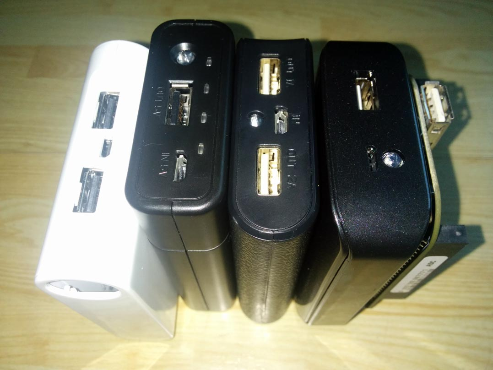
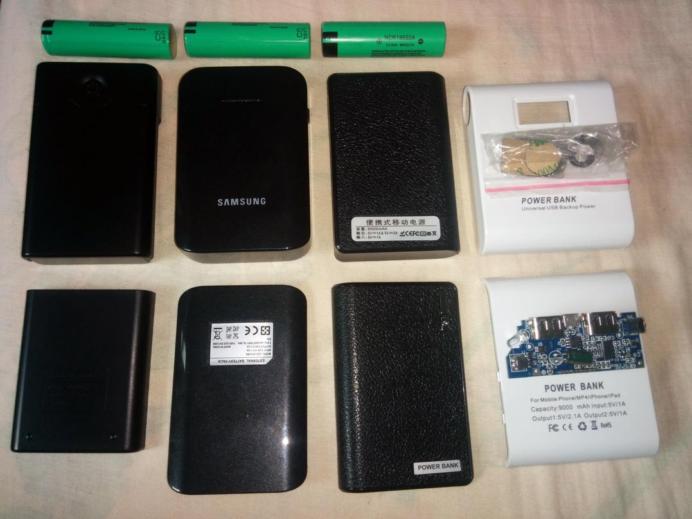
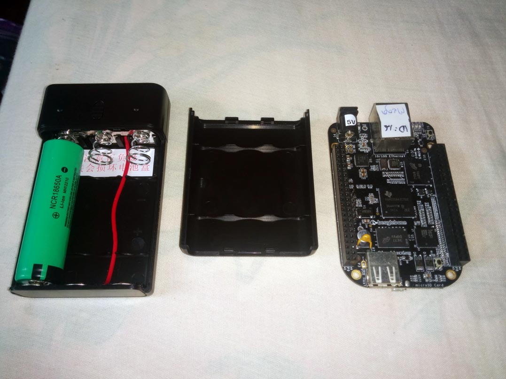
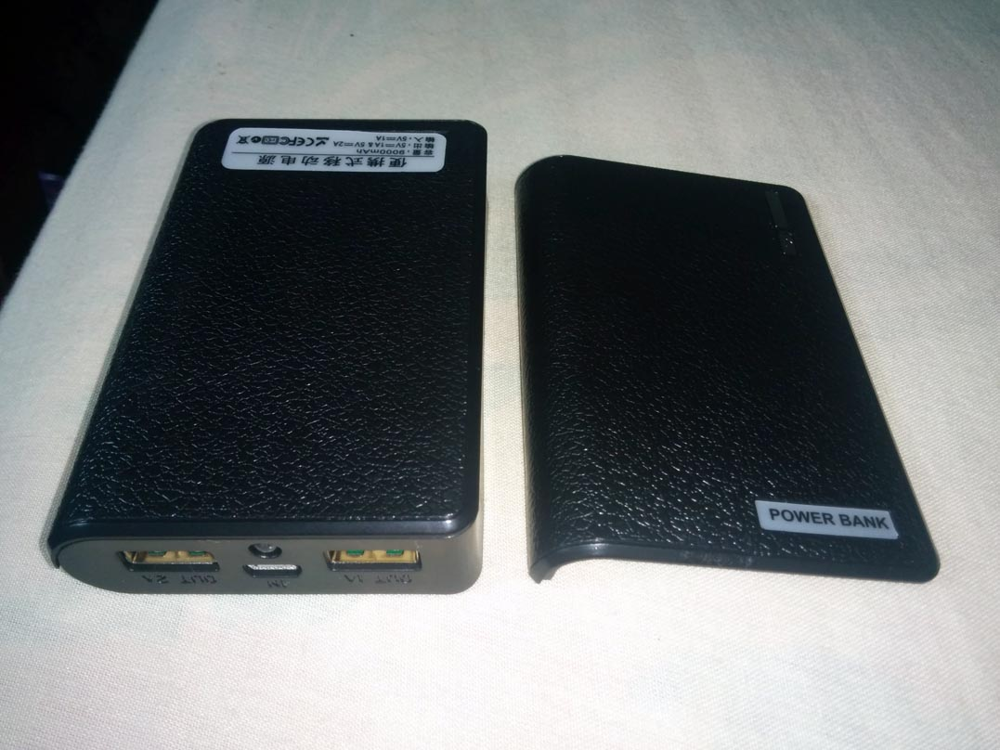

## Power Bank Comparison

In order to find the best match for the BeagleBone, I purchased four cheap power banks on Chinese commerce site Taobao and compared them, as follows:

All four power banks have a 5V micro USB input for charging, and have a built in LED which can be used as a flashlight. The following table gives an overview of the features and cost of each bank. For more details see the links column (in Chinese, but will useful images).

| Name	      | Outputs       | Charge LED's | Dimensions | Price   | DIY | Links    | Images   |
| ---------- | ------------- | ------------ | ---------- | ------- | --- | -------- | -------- | 
| Samsung    | 5V2A          | Y (top)      | 96x65x18   | 15 + 8  | N   | [here]() | [here]() |
| Square     | 5V1A + 5V2.1A | LCD panel    | 88x72x23   | 21 + 12 | Y   | [here]() | [here]() |
| Xinbo      | 5V?A          | Y (front)    | 99x59x22   | 25 + 6  | N   | [here]() | [here]() |
| Power Bank | 5V1A + 5V2A   | Y            | 95x62x19   | 9 + 8   | Y   | [here]() | [here]() |

DIY means the power bank comes with case and PCB, but not the battery connectors or wiring, which you have to do yourself. I bought these as they were cheap and could be good to use without the case i.e. to strap the PCB and a battery (or three) directly to the beaglebone itself for ultimate compactness. 

### Samsung

### Square

### Xinbo

### Power Bank

#### Measuring the Output of the Power Banks

As these are cheap and therefore potentially low quality devices, I wanted to measure the actual voltage and current output coming from the power banks, to make sure not to overload or underpower the beaglebone. To do this I made a tester cable by hacking off the end of an old USB cable, separating out the power cables, and connecting these to a multimeter. The results were as follows:

Samsung
Square
Xinbo
Power Bank
[table here]

#### Batteries

For this project I bought Panasonic NCR18650A's - a very common type of high capacity (3100mAh) lithium ion (Li-on) battery (see this [data sheet](http://www.panasonic.com/industrial/includes/pdf/ACA4000CE254-NCR18650A.pdf) and the [Panasonic website](http://industrial.panasonic.com/www-cgi/jvcr13pz.cgi?E+BA+4+ACA4001+NCR18650A+7+WW)). As far as I can tell, these are unprotected batteries i.e. they have no inbuilt circuitry to prevent overcharging or discharging below a certain level (see [below](#protected-vs-unprotected) for more about protected vs unprotected batteries).

##### Battery Comparison

As many of the batteries available on Taobao are fakes, I bought from three different sellers to spread the risk.

* The first set I purchased were sold as genuine unused batteries and cost 24yuan per battery with 7yuan postage. See [here](http://a.m.taobao.com/i12677731619.htm?ttid=212200@taobao_android_4.2.2)
* The second and third set were both advertised as reclaimed, retested batteries taken from old laptops. [One](http://a.m.taobao.com/i35858407101.htm?ttid=212200@taobao_android_4.2.2) was 12.5yuan per battery with 10yuan postage, [the other](http://a.m.taobao.com/i18265637568.htm?ttid=212200@taobao_android_4.2.2) was 13yuan/battery with 8yuan postage.

All these batteries are working fine right now, but time will tell as to which ends out

#### Protected vs Unprotected

Pro's and cons...[from here](http://budgetlightforum.com/node/25927)

Protected:
+ safer (under- & overvoltage protection, short circuit protection)
- longer (doesn't fit to all lights)

Unprotected:
+ shorter (fits most lights)
+ light doesn't shut off abruptly (good for divers etc.)
- not so safe

* The primary difference between the Protected and Unprotected batteries is that the protected batteries have a small circuit board, typically on the bottom of the battery, that stops the charging or discharge of the battery in certain circumstances.
* protected cells are longer around 69mm
* You need to be conscientious when running unprotected cells in lights, which is why I only use them in single cell designs

#### Battery Testing: Measuring Voltage/Current/Capacity of 18650 Cells

- problem: when trying to measure voltage and current, multimeter always reads 1

http://www.ehow.co.uk/how_8637164_measure-mah-multimeter.html
http://www.ehow.co.uk/how_8109841_test-lithiumion-batteries.html

Anatomy of a protected battery: http://www.lygte-info.dk/info/battery%20protection%20UK.html

