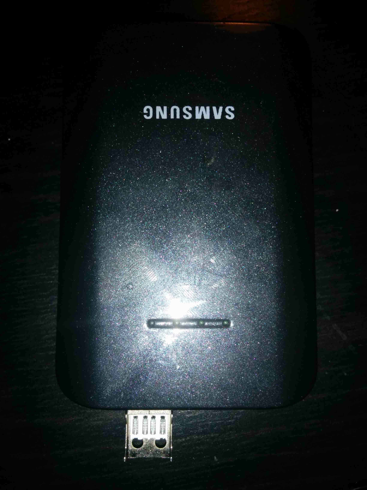
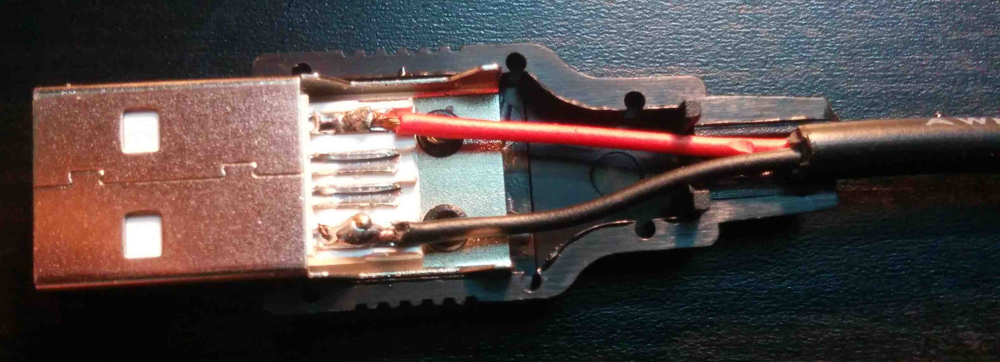
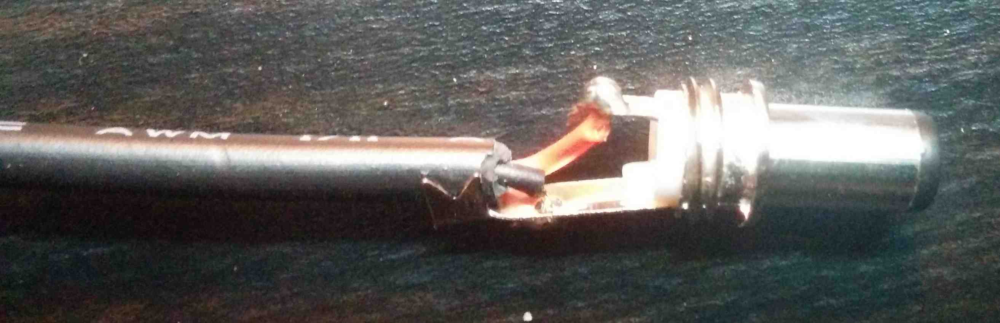
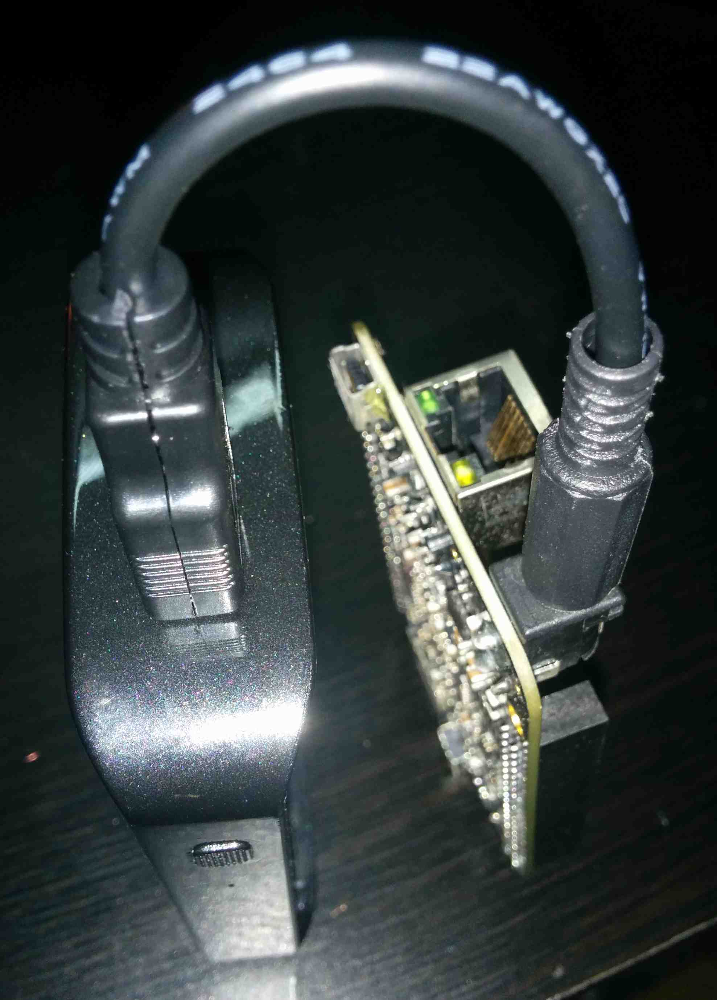

## Power

This document deals with the four methods of powering the beaglebone, these being: external PSU, power over USB, power over ethernet and battery power.

### 1. Using an External Power Supply
- beaglebone uses a 5V2A
- advisable as provides enough amps

### 2. Power Over USB
- is possible but not advisable as USB doesn't typically provide enough amps to reliably read and write to the SD card reader

### 3. Power Over Ethernet
- in some projects which use ethernet anyway, PoE would help in reducing cabling/complexity
- PoE is specified by IEEE 802.3-2005
- basic explanation:
"Power over Ethernet or PoE describes any of several standardized or ad-hoc systems which pass electrical power along with data on Ethernet cabling. This allows a single cable to provide both data connection and electrical power to devices such as wireless access points or IP cameras. Unlike standards such as Universal Serial Bus which also power devices over the data cables, PoE allows long cable lengths. Power may be carried on the same conductors as the data, or it may be carried on dedicated conductors in the same cable."
- from: http://www.thegeekstuff.com/2009/01/overview-of-poe-power-over-ethernet-concepts-and-devices-list/
- more details here: http://www.connect802.com/ethernet.htm
- use with Arduino here: http://www.freetronics.com/pages/power-over-ethernet-for-arduino

- There are two basic options for providing the power:

#### a. PoE enabled switch
- switch acts as a power source
- costs at least £25

#### b. Midspan
- power injector is injected by a device inserted between the switch and the beagle
- midspans seem to make no sense if a separate power adapter is needed for each one (is this the case?)
- midspans cost?
- a cheap but dodgy solution is to hack up and power an ethernet cable

### 4. Battery Power

In general, there are two options when it comes to powering the Beaglebone Black using batteries. The first is to provide power via the 5v barrel DC jack input - as we would when using a DC power supply - whilst the second is to do so via the dedicated power management chip on the Beaglebone itself. The advantage of the latter approach is that this chip can do fancy things like handling recharging of the battery (when a mains power supply is connected). However, the major downside is that the USB port does not receive power, which is essential for running a USB soundcard. For this reason, the 'barrel jack approach' is the preferred method for most applications.

### Powering the Beaglebone Black from a Power Bank (via the DC Barrel Jack)

Portable 'Power Banks' are commonly used in China for extending the life of mobile devices whilst on-the-go, and are an ideal way to power the Beaglebone Black, as:

* They typically have a 5V2A output (for tablets) - precisely the 
* They are available in a compact form-factor which is well-matched to the dimensions of the Beaglebone Black (the three-cell power banks in particular are well matched to the 88.4 x 55.2 x 19mm dimensions of the beaglebone)
* They use common, high-capacity 18650 lithium-ion cells
* They contain circuitry for handling reliable charging of such cells
* They are widely available and cheap to buy
* charge from a standard USB charger (5v)

##### Power Bank Overview

Almost all the available Power Banks use li-ion 18650 batteries, where the voltage output is stepped up from the standard 3.7v to the required 5v and the number of cells determines the overall capacity. Some cursory research on Chinese e-commerce website [Taobao](http://www.taobao.com) reveals a number of different types of Power Bank that are suitable for powering the Beaglebone Black. In addition some types contain a removable battery cover(http://a.m.taobao.com/i35081419154.htm), whilst others can [handle multiple voltages](http://a.m.taobao.com/i13062921497.htm) (not just 5v). The following are a 

#### [DIY Build](http://a.m.taobao.com/i35540106206.htm)
* This one you can buy the power bank parts
* This is a good candidate for making a diy battery shield (see images)

#### [Single battery](http://a.m.taobao.com/i36546498972.htm)
* This is commonly referred to under the name 'ML102'
* The 2014 version has a micro USB input for charging
* For supplying power, a standard A USB output is used
* Current is limited, but the description suggests it could supply 1200mA output (enough?)

#### [Dual Battery](http://a.m.taobao.com/i20085144001.htm)
* This is a compact and solid option, with 2A output

#### [Triple Battery](?):
* This is good size match for beaglebone:
- beagle is 86.40×53.3mm
- this bank is 75x75x22mm

##### Measuring the Output of the Power Bank

Before connecting the Power Bank to our precious Beaglebone we can use a multimeter to measure its actual output in terms of both voltage and current. Typically the connections inside a typical USB port are difficult to accesss. However, a simple way to overcome this is to connect a [male 'Standard A' USB connector] to the port and measure from the newly exposed points.

[This image](http://www.pinout.ca/wp-content/themes/directorypress/thumbs/USB_A_pinout1.jpg) shows the pinouts of a male 'Standard A' USB cable, while the process of - is shown in the image below:

{\includegraphics[height=0.5in]{./_images/power_3.jpg}}

As it turns out, this power bank isn't so useful for our purposes, as it only provides 1A output (presumably such a small bank is only geared-up to power mobile phones).

#### Making up a Connector Cable

Once satisfied with the power output, the next step is to make up a special cable for connecting the Power Bank to the Beaglebone Black. This will be a very short male Standard A USB to DC barrel jack cable (5.5x2.1mm). [This thread](https://groups.google.com/forum/#!msg/beagleboard/6hQ7voyk_Xw/F37ZHV6dKsoJ) suggests that 
powered via USB (as when using the [ethernet over USB method], but as they mention, they "do not know if the USB input on the Beaglebone limits current draw to 500mA - If so, you may need to make a special cable to feed the power into the dedicated power socket instead.". The process of making such a cable is shown below:

Soldering the USB Standard A connections:

Soldering the DC Barrel Jack connections (Don't forget to thread the barrel jack sleeve onto the cable before soldering!):

The finished cable in use looks like this:

#### Real World Testing: How long can three batteries last?

Fredrik Olofsson reports that "With the 5000mAh 5v battery fully charged, the system runs for about 9.5 hours."

### Powering the Beaglebone via the Onboard TPS65217C Power Management Chip

_NOTE: this section of the guide is untested_

- beaglebone uses the TPS65217C for power management [link to datasheet]()
- can be used to run from and to charge a battery
- a common way to power the beaglebone is via a single cell lion or lipo battery (typically 3.7v)
- If the main supply gets disconnected, the battery immediately takes over.

- backup battery

TI TPS65217C handles power management and is programmable. The IC also contains built-in battery charging capability.

report that 5V via tp5 does not work with a thermistor soldered.l between tp7 and tp8:
https://groups.google.com/forum/m/#!msg/beagleboard/TYYoGbcnGO0/oLLtgCXHaUEJ

usb tutorial below successfully powers the BBB from battery via the 5v barrel jack input. Other users report stability problems this way...
http://archlinuxarm.org/forum/viewtopic.php?f=28&t=5505

reports that a 1400mah lasts 2h50m / charges in about 2 hours

tp5 bat - battery connection point
tp6 sense - battery voltage sense input
tp7 ts - temp sense input
tp8 gnd - system ground

### Futher Reading
- basic guide: http://pansenti.wordpress.com/2013/06/01/powering-a-beaglebone-black-with-a-single-cell-li-ion-or-lipo-battery-yes-it-can-be-done-but-there-are-issues/
- follow up hack (not advisable): http://pansenti.wordpress.com/2013/06/01/battery-powered-beaglebone-black-and-the-usb-host-port-works-too/
- discussion: https://groups.google.com/forum/#!topic/beagleboard/6hQ7voyk_Xw
- beaglebone battery tutorial here: http://www.element14.com/community/community/knode/single-board_computers/next-gen_beaglebone/blog/tags/bbb

Non USB tutorial - great info here:
http://www.element14.com/community/community/knode/single-board_computers/next-gen_beaglebone/blog/2013/08/10/bbb--rechargeable-on-board-battery-system

Another tutorial here based on similar approach:
http://www.beaglebone-asterisk.org/uninterruptible-power-supply-ups-for-beaglebone-black-a-diy-project/

Tutorial with USB here (not compact but works):
http://insigntech.wordpress.com/2013/09/10/power-bbb-on-car-battery-12vdc/
a 12v battery is stepped down to 5v, which powers both the beagle (5v jack in) and a powered usb hub. The hub runs from the beagles usb port and hosts two usb devices

Fredrik's approach here (see orfi_twitter section):
https://github.com/redFrik/udk10-Embedded_Systems/blob/master/udk131219/README.md
With the 5000mAh 5v battery fully charged, the system runs for about 9.5 hours.

Sparkfun LiPo advice:
https://www.sparkfun.com/tutorials/241

- https://github.com/redFrik/udk10-Embedded_Systems/tree/master/udk131219#--extra-power-consumption

(and as noted [here](TODO), this is not possible using a 3.7v li-on cell directly)

- battery capes are available, may be useful to study their design e.g. : http://circuitco.com/support/index.php?title=BeagleBone_Battery

Capes:
These capes support powering the USB port
http://andicelabs.com/beaglebone-powerbar/
http://andicelabs.com/beaglebone-powercape/
